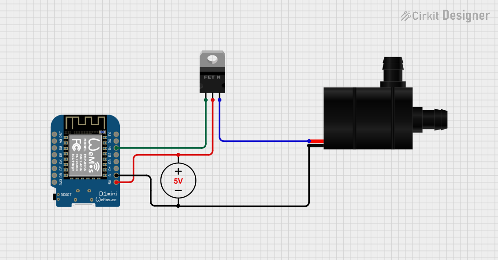

# Система полива на ESP8266
Для связи микроконтроллера ESP8266 с клиентом используется Telegram-бот.
Основная цель проекта — осуществить удобное управление поливом растений при наименьшем бюджете.

## Начало работы
### Подключение

Для начала работы подключите подходящий MOSFET-транзистор к GPIO 5 (на Wemos D1 Mini это порт D1) вашей ESP8266. Обратите внимание на то, чтобы источник питания мог выделить нужную мощность (источник питания может быть любым), а также насос потреблял ровно 5 В.
### Библиотеки
Для начала установите все зависимости.
- [SimplePortal](https://github.com/GyverLibs/SimplePortal?ysclid=mjvpuq13rq570425773)
- [NTPClient](https://github.com/arduino-libraries/NTPClient?ysclid=mjvqa1kgtx922965074)
- [FileData](https://github.com/GyverLibs/FileData?ysclid=mjvpvotjyn12142490)
- [FastBot](https://github.com/GyverLibs/FastBot?ysclid=mjvpsrm3y9666586321)

### Подключение к Wi-Fi
При первом включении микроконтроллер нужно подключить к Интернету. 
В будущем он будет подключаться к нему сам, если, конечно, найдет поблизости ранее заданную точку доступа Wi-Fi.

